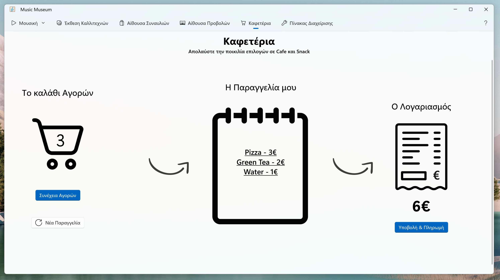

# 🎶 Music Museum

**A virtual journey through the sounds, stories, and spaces of music culture.**

> ℹ️ This project is not open source and does not grant any usage rights.
> For usage terms and legal information, see [Code Ownership & Usage Terms](#-code-ownership--usage-terms).

## 📖 Overview  

Music Museum is a modern Windows desktop application built with WinAppSDK and C#. It offers users an immersive digital experience centered around Greek music culture. Through a rich and interactive interface, users can explore artist exhibitions, enjoy curated music playlists, watch screenings, and even order snacks from a virtual cafeteria—all within a unified application environment.

> 📌 The **`resources`** folder contains supporting material such as screenshots.

## ✨ Features  

- Role-based login system (Citizen or Staff)  
- Artist Exhibition Hall with biographical profiles and media  
- Integrated music player with playlist and sound effects  
- Screening Room for music-related video content  
- Concert Hall with environmental controls  
- Cafeteria ordering system with shopping cart and payment interface  
- Room Management Panel for staff to control room status and temperature

## 🛠️ Technologies Used  

- WindowsAppSDK / WinUI3
- XAML for the UI
- C# for Business Logic

## 🎯 Purpose 

Music Museum was created to offer users a rich and engaging experience of music culture through a virtual environment. It brings together interactive exhibitions, music playback, screenings, and ambient spaces that simulate the atmosphere of a real museum. The application invites users to explore, enjoy, and connect with the essence of musical identity in a modern and immersive way. **It is developed solely for academic and research purposes.**


## 🧰 Prerequisites  

- **Windows 10 version 1809 or later** (Windows 11 recommended)
- **Visual Studio 2022** (version 17.1 or newer)
- Installed Workloads:
  - .NET Desktop Development
  - Windows App SDK C# Templates
- **.NET SDK** (version 6)
- **Developer Mode** enabled in Windows


## 📦 Installation  

Follow these steps to install and run the application:

1. **Clone the repository (or download and decompress the ZIP file)**
   ```bash
   git clone https://github.com/kpavlis/music-museum-app.git
   cd music-museum-app
2. **Open the project in Visual Studio 2022** using the `.sln` file
3. **Confirm that the following NuGet packages are installed:**
    - Microsoft.WindowsAppSDK (version **10.0.26100.x**)
    - Microsoft.Windows.SDK.BuildTools (version **1.8.x**)
4. **Verify Target Framework**
     In your `.csproj` file, ensure the framework is set correctly:
   
     ```xml
     <TargetFramework>net6.0-windows10.0.19041.0</TargetFramework>
   
6. **Run the application** as _Unpackaged app_

## 📷 Screenshots / Video

**_App Screens:_**  
> 
> 
> 
> 
> 
> 
> 
> 

**_Demo Video:_**

> https://github.com/user-attachments/assets/8bbe079b-ae13-4ad9-8077-d5da755e2fb6

# 🔒 Code Ownership & Usage Terms

This project was created and maintained by:

- Konstantinos Pavlis (@kpavlis)
- Theofanis Tzoumakas (@theofanistzoumakas)

🚫 **Unauthorized use is strictly prohibited.**  
No part of this codebase may be copied, reproduced, modified, distributed, or used in any form without **explicit written permission** from the owners.

Any attempt to use, republish, or incorporate this code into other projects—whether commercial or non-commercial—without prior consent may result in legal action.

For licensing inquiries or collaboration requests, please contact via email: konstantinos1125 _at_ gmail.com .

© 2025 Konstantinos Pavlis, Theofanis Tzoumakas. All rights reserved.
